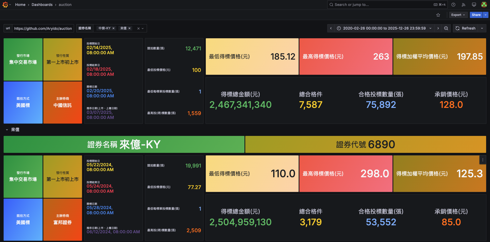
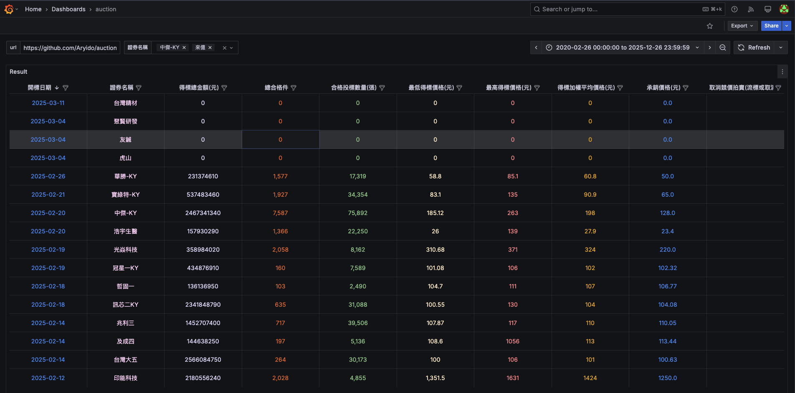

# Auction Data Visualization

This project automates the fetching, storage, and visualization of auction data from the [TWSE API](https://www.twse.com.tw/zh/announcement/auction.html). The data is visualized using Grafana, which is deployed on a GCP VM managed by Ansible and provisioned by Terraform.

[Grafana Dashboard](http://aryido.org:3000/login) (account: **viewer** ; password: **viewer**)




## Project Overview

### Data Fetching & Processing
- **Script**: [`auction.py`](auction.py)
- **Purpose**: Fetch auction data, convert it to CSV, and merge new data with existing CSV files.
- **Automation**:
  - Scheduled by GitHub Actions workflow [`schedule-get-auction.yaml`](.github/workflows/schedule-get-auction.yaml)
  - Runs automatically every 2 days.
  - After processing, commits and pushes the updated auction CSV file to the GitHub repository.

### Grafana Dashboard
- **Deployment**: Grafana is deployed onto a GCP VM using Ansible.
- **Infrastructure**: All GCP resources (including the VM) are provisioned and managed by Terraform.
- **Data Source**: Grafana pulls the latest auction CSV file directly from this GitHub repository.

## Setup and Installation

### Prerequisites
- GCP
- Terraform
- Ansible

### Step 1: Terraform Setup
Initialize and apply the Terraform configuration:

1. Create a `terraform.tfvars` file in `infra/terraform` folder:
    ```hcl
    project_id = <YOUR_GCP_PROJECT_ID>
    ```

2. If you want to store the Terraform state in a GCS bucket, configure the backend in [`provider.tf`](infra/terraform/provider.tf):
    ```hcl
    backend "gcs" {
      bucket  = "<YOUR_GCS_BUCKET_NAME>"
      prefix  = "terraform/state"
    }
    ```

3. Run the following commands:
    ```sh
    cd infra/terraform
    terraform init
    terraform apply
    ```

### Step 2: Ansible Setup
Update the Ansible inventory and configuration files as needed, and then run:
```sh
cd infra/ansible
ansible-playbook ./playbooks/site.yaml
```

# Acknowledgements

## Cloud
- GCP
  - global address
  - VPC
  - firewall rule
  - compute instance

## Containerization
- Docker
  - docker-compose

## Infrastructure as Code (IaC)
- Terraform
- Ansible

## CI/CD
- GitHub Actions

## Global Network
- Nginx
- Cloudflare

## Application
- Grafana